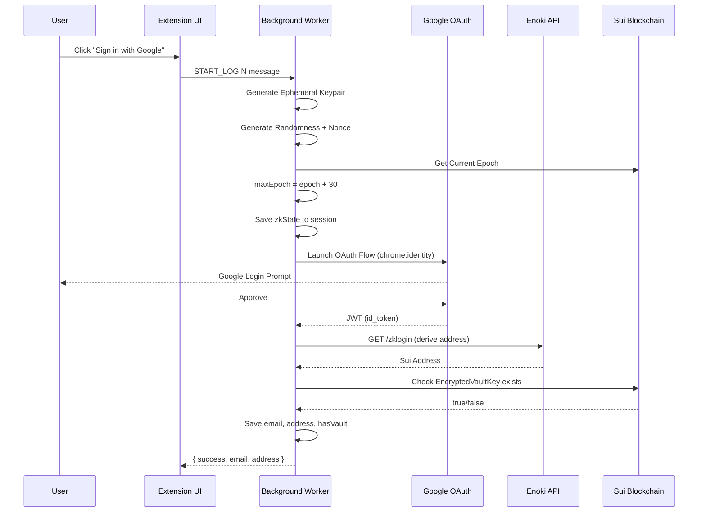

# Authentication Flow

Orion uses **Sui zkLogin** (via Mysten's Enoki service) to provide a seamless Web2 login experience. Users sign in with their Google account and receive a deterministic Sui address — no wallets, no seed phrases.

## Flow Diagram



## Technical Details

### 1. Ephemeral Keypair Generation

Each login session generates a fresh Ed25519 keypair that is valid for `maxEpoch` (current epoch + 30 ≈ 30 days):

```typescript
const ephemeralKeyPair = new Ed25519Keypair();
const randomness = generateRandomness();
const maxEpoch = currentEpoch + 30;
const nonce = generateNonce(
  ephemeralKeyPair.getPublicKey(),
  maxEpoch,
  randomness
);
```

### 2. Google OAuth via Chrome Identity API

The background worker uses `chrome.identity.launchWebAuthFlow()` for a native OAuth experience:

```typescript
chrome.identity.launchWebAuthFlow(
  { url: authUrl, interactive: true },
  async (redirectUrl) => {
    const url = new URL(redirectUrl.replace('#', '?'));
    const jwt = url.searchParams.get('id_token');
    // ...
  }
);
```

### 3. Sui Address Derivation (Enoki)

The JWT is sent to Enoki to deterministically derive a Sui address:

```typescript
const response = await fetch(`${ENOKI_ENDPOINT}/zklogin`, {
  method: 'GET',
  headers: {
    'Authorization': `Bearer ${ENOKI_API_KEY}`,
    'zklogin-jwt': jwt
  }
});
const { data } = await response.json();
// data.address → "0x..."
```

<Callout type="info">
  The same Google account always produces the **same Sui address** — this is deterministic and managed by Enoki's salt service.
</Callout>

### 4. zkProof Generation

When the user initializes or unlocks their vault, a zero-knowledge proof is generated:

```typescript
const zkProof = await getZkProof(jwt, {
  maxEpoch: zkState.maxEpoch,
  randomness: zkState.randomness,
  ephemeralPublicKey: zkState.ephemeralPublicKey
});
```

This proof allows blockchain transactions to be signed without revealing the user's Google identity on-chain.

### 5. Credential Persistence

To avoid re-authenticating with Google on every browser restart, the JWT, zkState, and zkProof are encrypted with the user's KEK and stored locally:

```typescript
const sealedCreds = await CredentialManager.encryptCredentials(
  jwt, zkState, zkProof, cryptoSecret
);
await chrome.storage.local.set({
  [LocalStorageKey.ENCRYPTED_ZK_CREDENTIALS]: sealedCreds
});
```

On unlock, these credentials are decrypted with the Master PIN, restoring the full session without any network calls to Google or Enoki.

## Post-Login States

After successful login, the extension determines the user's vault state:

| State | Condition | Next Screen |
|---|---|---|
| **New User** | No `EncryptedVaultKey` on-chain | Create Vault (set Master PIN + Recovery Code) |
| **Returning User** | `EncryptedVaultKey` exists | Unlock Vault (enter Master PIN) |
