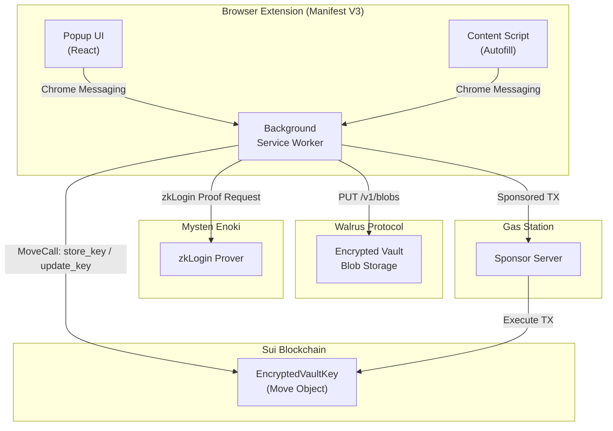
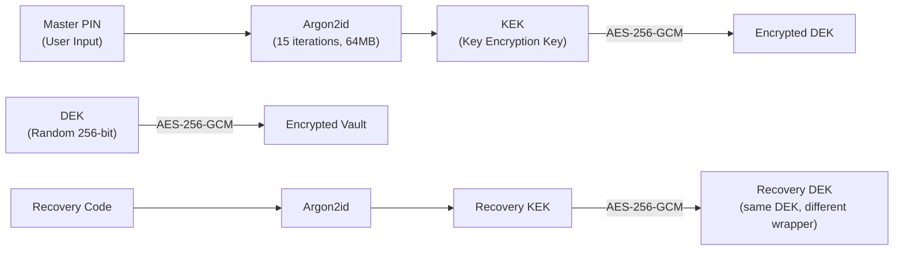

import { Callout } from 'fumadocs-ui/components/callout';
import { Step, Steps } from 'fumadocs-ui/components/steps';

# Architecture Overview

Orion is a **zero-knowledge, decentralized password manager** that combines the security of client-side AES-256-GCM encryption with the permanence of on-chain storage on **Sui** and **Walrus**. Users authenticate via **zkLogin** (Google OAuth), eliminating the need for seed phrases or wallets.

<Callout type="info">
  Orion was designed and built for the **CommandOSS Hackathon** by Mysten Labs — leveraging 100% native Sui technologies.
</Callout>

## System Components

The ecosystem consists of four deployable units:

| Component | Technology | Purpose |
|---|---|---|
| **Extension** | React + TypeScript + Vite (Manifest V3) | User-facing browser extension with popup UI, content scripts, and background service worker |
| **Smart Contract** | Sui Move | On-chain vault pointer (`EncryptedVaultKey`) with versioned rotation and event emission |
| **Gas Station** | Node.js (Express) | Sponsored transaction relay — users never pay gas fees |
| **Landing** | Vite + React | Marketing page and public documentation |

## High-Level Data Flow

## Zero-Knowledge Encryption Model

Orion follows a **two-layer key hierarchy** inspired by industry standards like 1Password and Bitwarden:

1. **DEK (Data Encryption Key):** A random 256-bit key generated once per vault. It encrypts all credential data.
2. **KEK (Key Encryption Key):** Derived from the user's Master PIN via Argon2id. It wraps (encrypts) the DEK.
3. **Recovery KEK:** Derived from a one-time Recovery Code. It wraps the same DEK, providing an independent recovery path.

<Callout type="warning">
  The Master PIN and Recovery Code are **never stored** anywhere — not in the extension, not on the blockchain, not on Walrus. If both are lost, the vault is cryptographically irrecoverable.
</Callout>

## Vault Synchronization Pipeline

Every CRUD operation (Add / Edit / Delete credential) triggers an **atomic, serialized sync pipeline**:

<Steps>
### Step 1: Local Mutation
The credential is encrypted with the DEK and saved to Chrome's `session` storage (RAM-only).

### Step 2: Encrypt & Package
The full vault is re-encrypted with the DEK. The DEK itself is re-wrapped with the KEK. Both are bundled into a `WrappedVaultPayload`.

### Step 3: Upload to Walrus
The encrypted payload is uploaded as a binary blob to the Walrus Publisher endpoint, returning a `blobId`.

### Step 4: Update On-Chain Pointer
A `MoveCall` to `sui_seal::update_key` updates the `EncryptedVaultKey` object with the new `blobId`. This transaction is **sponsored** (zero gas for users) and signed with a **zkLogin signature**.

### Step 5: Offline Cache
The encrypted payload and latest `blobId` are cached in `chrome.storage.local` for instant offline recovery.
</Steps>

## Technology Stack

| Layer | Technology | Why |
|---|---|---|
| **Authentication** | zkLogin (Enoki) | Web2-grade UX — sign in with Google, no seed phrases |
| **Key Derivation** | Argon2id (hash-wasm) | Memory-hard KDF resistant to GPU/ASIC brute-force attacks |
| **Encryption** | AES-256-GCM (Web Crypto API) | Authenticated encryption with associated data (AEAD) |
| **Decentralized Storage** | Walrus Protocol | Content-addressed, immutable blob storage on Sui |
| **On-Chain State** | Sui Move (EncryptedVaultKey) | Versioned pointer to the latest Walrus blob, owned by the user's zkLogin address |
| **Gas Sponsorship** | Enoki Sponsored Transactions | Users never need SUI tokens to interact with the blockchain |
| **Extension Runtime** | Chrome Manifest V3 | Service worker-based background, Shadow DOM content scripts |
