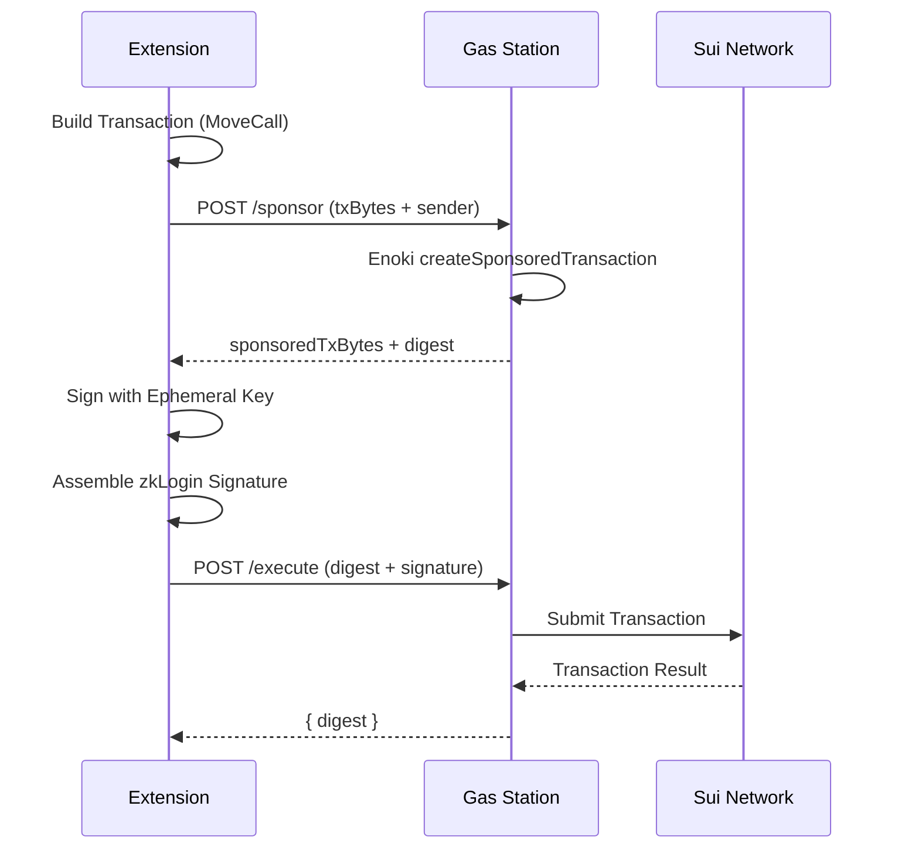

import { Callout } from 'fumadocs-ui/components/callout';


# Smart Contract

The Orion smart contract is written in **Sui Move** and deployed on **Sui Testnet**. It serves as the **trust anchor** of the entire system — a tamper-proof, user-owned pointer to the latest encrypted vault blob on Walrus.

<Callout type="info">
  **Package ID:** `0xfd5ea9c62a35a86eaa0d4afb74d7b4d0e9547084335a19a660d592c0992a292b`  
  **Module:** `sui_seal`  
  **Network:** Sui Testnet
</Callout>

## Why On-Chain?

Unlike centralized password managers (LastPass, Chrome Passwords), Orion's on-chain pointer guarantees:

1. **User Ownership:** The `EncryptedVaultKey` is an owned object — only the user's zkLogin address can modify it.
2. **Immutable Audit Trail:** Every rotation emits an event, creating a permanent history on the Sui blockchain.
3. **Censorship Resistance:** No centralized party can lock the user out of their vault pointer.
4. **Cross-Device Discovery:** Any device can discover the user's vault by querying their Sui address.

## Contract Structure

The contract consists of a single module with two core functions:

```
liquify-contract/
├── Move.toml
├── Published.toml
└── sources/
    └── sui_seal.move       # Vault pointer management
```

## Data Model

### EncryptedVaultKey

The primary on-chain object — acts as a pointer to the encrypted vault on Walrus:

```move
public struct EncryptedVaultKey has key {
    id: UID,
    /// Reference to the encrypted vault on Walrus (binary safe)
    walrus_blob_id: vector<u8>,
    /// Monotonically incrementing version counter
    version: u64,
    /// Epoch when the seal was first created
    created_at: u64,
}
```

| Field | Type | Purpose |
|---|---|---|
| `id` | `UID` | Unique Sui object identifier |
| `walrus_blob_id` | `vector<u8>` | UTF-8 encoded Walrus blob ID (content-addressed hash) |
| `version` | `u64` | Monotonically incrementing counter, starts at 1 |
| `created_at` | `u64` | The Sui epoch when the vault was first created |

<Callout type="warning">
  The `walrus_blob_id` stores the **reference** to encrypted data, not the data itself. The actual encrypted vault lives on Walrus. Even if someone reads this on-chain, they only get an opaque blob ID — the content is AES-256-GCM encrypted and cryptographically useless without the user's Master PIN.
</Callout>

### Events

Two events provide a full audit trail:

```move
/// Emitted when a new vault is created
public struct KeyStoredEvent has copy, drop {
    key_id: ID,
    owner: address,
}

/// Emitted when the vault pointer is rotated
public struct KeyRotatedEvent has copy, drop {
    key_id: ID,
    owner: address,
    version: u64,
}
```

## Core Functions

### `store_key` — Create a New Vault Pointer

Called once per user during vault initialization. Creates a new `EncryptedVaultKey` and transfers it to the sender.

```move
public fun store_key(
    walrus_blob_id: vector<u8>,
    ctx: &mut TxContext
) {
    assert!(vector::length(&walrus_blob_id) > 0, EInvalidBlobId);

    let id = object::new(ctx);
    let key_id = object::uid_to_inner(&id);
    let sender = tx_context::sender(ctx);

    let vault_key = EncryptedVaultKey {
        id,
        walrus_blob_id,
        version: 1,
        created_at: tx_context::epoch(ctx),
    };

    event::emit(KeyStoredEvent { key_id, owner: sender });
    transfer::transfer(vault_key, sender);
}
```

**Security properties:**
- ✅ Validates `walrus_blob_id` is non-empty
- ✅ Object is transferred to `tx_context::sender` (the user's zkLogin address)
- ✅ Emits `KeyStoredEvent` for indexing and audit

### `update_key` — Rotate the Vault Pointer

Called on every sync operation. Updates the `walrus_blob_id` to point to the latest encrypted blob.

```move
public fun update_key(
    vault_key: &mut EncryptedVaultKey,
    new_walrus_blob_id: vector<u8>,
    ctx: &mut TxContext
) {
    assert!(vector::length(&new_walrus_blob_id) > 0, EInvalidBlobId);

    vault_key.walrus_blob_id = new_walrus_blob_id;

    let old_version = vault_key.version;
    vault_key.version = old_version + 1;

    event::emit(KeyRotatedEvent {
        key_id: object::id(vault_key),
        owner: tx_context::sender(ctx),
        version: vault_key.version,
    });
}
```

**Security properties:**
- ✅ Requires `&mut EncryptedVaultKey` — only the **owner** can provide this reference (enforced by Sui's object model)
- ✅ Version is **monotonically incremented** — prevents rollback attacks
- ✅ Emits `KeyRotatedEvent` with the new version number

## Object Discovery

The extension discovers the user's vault by querying owned objects filtered by struct type:

```typescript
// From: src/lib/sui-parser.ts
const objects = await client.getOwnedObjects({
  owner: suiAddress,
  filter: {
    StructType: `${PACKAGE_ID}::sui_seal::EncryptedVaultKey`
  },
  options: { showContent: true }
});
```

If multiple `EncryptedVaultKey` objects exist (edge case from failed past operations), the parser selects the one with the **highest version number**.

## Transaction Execution

All on-chain transactions use **zkLogin + Sponsored Transactions**:



<Callout type="info">
  Users **never need SUI tokens**. All gas fees are covered by the project's Gas Station via Enoki's Sponsored Transaction API.
</Callout>
