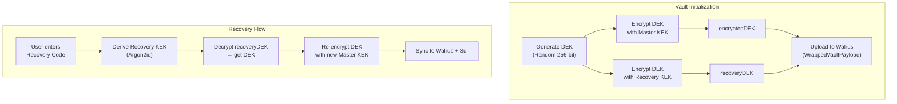

import { Callout } from 'fumadocs-ui/components/callout';
import { Step, Steps } from 'fumadocs-ui/components/steps';


# Recovery Module

The Recovery Module provides a **decentralized escape hatch** for users who lose their Master PIN. Unlike centralized password managers where a company can reset your account, Orion's recovery is entirely **self-sovereign** — only the user holding the Recovery Code can restore access.

## How It Works



## Data Structure

The `WrappedVaultPayload` stored on Walrus always contains both key wrappers:

```typescript
interface WrappedVaultPayload {
  encryptedDEK: SealedPackage;     // DEK → KEK (Master PIN)
  recoveryDEK?: SealedPackage;     // DEK → Recovery KEK
  vaultPackage: SealedPackage;     // Vault → DEK
}
```

## Recovery Flow (Step by Step)

<Steps>

### Step 1: Fetch Vault Pointer from Sui

The system queries the Sui blockchain directly to find the user's latest `EncryptedVaultKey`, regardless of local storage state:

```typescript
const sealClient = new SuiSealClient();
const pointer = await sealClient.getLatestSeal(suiAddress);
// pointer.objectId → "0x..."
// pointer.walrusBlobId → "abc123..."
```

### Step 2: Download Encrypted Payload from Walrus

```typescript
const storage = new WalrusAdapter();
const wrapped = await storage.readWrappedPayload(pointer.walrusBlobId);
```

### Step 3: Decrypt DEK with Recovery Code

The Recovery Code is used to derive a Recovery KEK, which decrypts the `recoveryDEK` field:

```typescript
const recoveryCryptoSecret = await sha256(recoveryCode + suiAddress);
const dek = await CryptoEngine.decrypt(
  wrapped.recoveryDEK,
  recoveryCryptoSecret
);
```

<Callout type="warning">
  If the Recovery Code is incorrect, `CryptoEngine.decrypt` will throw an `OperationError` (AES-GCM authentication failure). The system catches this and returns `"Incorrect Recovery Code"`.
</Callout>

### Step 4: Re-encrypt with New Master PIN

The recovered DEK is re-wrapped with a new Master KEK derived from the user's new Master PIN:

```typescript
// Set new session with recovered DEK
await SessionManager.setSession(newPin, 30, newCryptoSecret, dek);

// Trigger sync (re-encrypts DEK with new KEK, uploads to Walrus)
await executeSyncVault({
  jwt, zkState, zkProof,
  objectId: pointer.objectId,
  sponsorUrl
});
```

### Step 5: Update Local Credentials

The encrypted zkLogin credentials are also re-encrypted with the new KEK:

```typescript
const sealedCreds = await CredentialManager.encryptCredentials(
  jwt, zkState, zkProof, newCryptoSecret
);
await chrome.storage.local.set({
  [LocalStorageKey.ENCRYPTED_ZK_CREDENTIALS]: sealedCreds,
  [LocalStorageKey.ORION_SEAL_OBJECT_ID]: pointer.objectId
});
```

</Steps>

## Recovery Code Generation

The Recovery Code is generated during **vault initialization only**. It is a user-provided string (minimum 8 characters) that is:

1. Combined with the user's Sui address: `sha256(recoveryCode + suiAddress)`
2. Used as input to Argon2id to derive a Recovery KEK
3. Used to encrypt the DEK into the `recoveryDEK` field

```typescript
const recoveryCryptoSecret = await sha256(recoveryCode + suiAddress);
const recoveryDEK = await CryptoEngine.encrypt(dek, recoveryCryptoSecret);
```

<Callout type="info">
  The Recovery Code is **address-bound** — the same code used with a different Google account produces a completely different KEK, making it useless for cross-account attacks.
</Callout>

## Backward Compatibility

Vaults created before the Recovery feature was added will not have a `recoveryDEK` field. The system handles this gracefully:

```typescript
if (!wrapped.recoveryDEK) {
  return {
    error: 'This vault does not support Recovery Codes.'
  };
}
```

## Recovery Code Preservation During Sync

When the vault is synced (after any CRUD operation), the system **preserves the existing `recoveryDEK`** from the previous payload:

```typescript
// From background.ts — executeSyncVault
let recoveryDEK = undefined;
try {
  const oldWrapped = await StorageManager.getEncryptedVault();
  if (oldWrapped?.recoveryDEK) {
    recoveryDEK = oldWrapped.recoveryDEK;
  }
} catch (e) {
  console.warn('Failed to read old recoveryDEK');
}

const wrappedPayload = {
  encryptedDEK,
  vaultPackage,
  ...(recoveryDEK ? { recoveryDEK } : {})
};
```

This ensures the Recovery Code remains valid across all sync operations without requiring the user to re-enter it.
