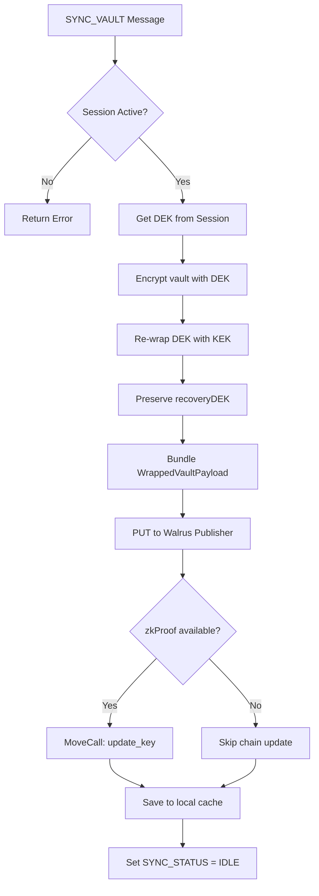

import { Callout } from 'fumadocs-ui/components/callout';


# Background Service Worker

The `background.ts` module is the **Secrets Engine** of Orion. It runs as a Manifest V3 service worker and acts as the single source of truth for all sensitive operations.

## Responsibilities

| Domain | Operations |
|---|---|
| **Session** | Set, get, extend, clear session (PIN + KEK + DEK) |
| **Vault CRUD** | Save, update, delete encrypted credentials |
| **Sync** | Encrypt vault → Upload to Walrus → Update Sui pointer |
| **Autofill** | Decrypt credentials and send to content scripts |
| **Auth** | Orchestrate Google OAuth + zkLogin flow |
| **Recovery** | Master PIN change and Emergency Kit recovery |

## Serial Sync Queue

The most critical architectural decision in the background worker is the **serial sync queue**:

```typescript
let syncPromise: Promise<any> = Promise.resolve();

async function executeSyncVault(payload: any) {
  syncPromise = syncPromise.then(async () => {
    // 1. Encrypt vault with DEK
    // 2. Re-wrap DEK with KEK
    // 3. Upload to Walrus
    // 4. Update Sui EncryptedVaultKey
    // 5. Update local cache
  });
  return syncPromise;
}
```

This prevents **race conditions** when users rapidly add/edit/delete credentials. Without this queue, concurrent Walrus uploads could result in the Sui pointer referencing a stale blob.

## Sync Pipeline Detail



## Message Handlers

### Session Management

| Message | Handler | Description |
|---|---|---|
| `SET_SESSION` | `SessionManager.setSession(pin, timeout, cryptoSecret)` | Creates a new vault session |
| `GET_SESSION` | `SessionManager.getSession()` | Returns current session or null |
| `EXTEND_SESSION` | `SessionManager.extendSession(timeout)` | Extends session expiry |
| `CLEAR_SESSION` | `SessionManager.clearSession()` | Wipes all session data from RAM |

### Vault Operations

| Message | Handler | Description |
|---|---|---|
| `GET_VAULT` | `SessionManager.getVault()` | Returns decrypted vault from session RAM |
| `SAVE_SECRET` | Encrypt password with DEK, save to session | Adds a new credential |
| `UPDATE_SECRET` | Re-encrypt if password changed, update session | Edits a credential |
| `DELETE_SECRET` | `SessionManager.deleteSecret(id)` | Removes a credential |
| `SYNC_VAULT` | `executeSyncVault(payload)` | Full sync pipeline |

### Autofill

| Message | Handler | Description |
|---|---|---|
| `GET_DOMAINS_CREDENTIALS` | Filter vault by hostname | Returns matching credential metadata |
| `AUTOFILL_REQUEST` | Decrypt + send FILL_FIELDS to active tab | Popup-triggered autofill |
| `INLINE_FILL_REQUEST` | Decrypt by credential ID | Content script autofill |
| `GET_DECRYPTED` | Decrypt password for display | Password reveal in UI |

### Security Operations

| Message | Handler | Description |
|---|---|---|
| `START_LOGIN` | OAuth + zkLogin flow | Returns `{ email, address }` |
| `CHANGE_MASTER_PASSWORD` | Re-encrypt credentials + trigger sync | Master PIN change |
| `RECOVER_MASTER_PASSWORD` | Fetch from Sui → decrypt with Recovery → re-wrap | Emergency recovery |

## Session Manager

The `SessionManager` class manages vault session lifecycle using Chrome's `session` storage (RAM-only):

```typescript
class SessionManager {
  static async setSession(pin, timeout, cryptoSecret?, dek?) {
    const expiresAt = timeout === 0
      ? -1                          // Never expires
      : Date.now() + (timeout * 60_000);
    await chrome.storage.session.set({
      pin, cryptoSecret, dek, expiresAt,
      vault_last_activity: Date.now()
    });
  }

  static async getSession() {
    // Returns null if PIN missing or session expired
    // Auto-clears expired sessions
  }

  static startExpiryListener() {
    setInterval(() => this.getSession(), 10_000); // 10s poll
  }
}
```

<Callout type="info">
  `chrome.storage.session` is automatically wiped when the browser process exits. This means closing Chrome immediately locks the vault — no sensitive data survives in local storage.
</Callout>
