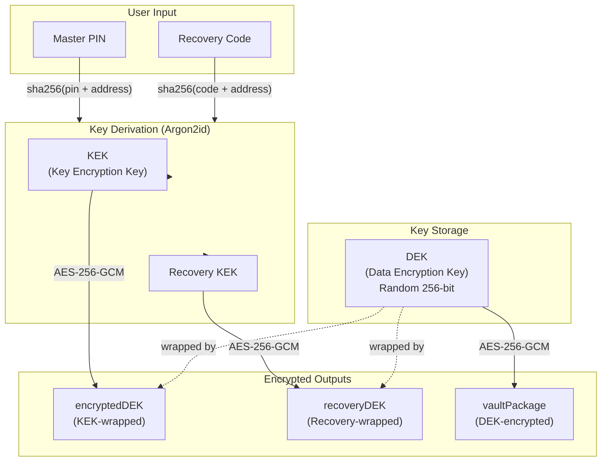

import { Callout } from 'fumadocs-ui/components/callout';


# Crypto Engine

The `CryptoEngine` class (`src/lib/crypto.ts`) is the cryptographic core of Orion. All encryption and decryption happens **exclusively on the client** — the background service worker and Walrus only ever handle ciphertext.

## Key Hierarchy



## API Reference

### `CryptoEngine.encrypt(plaintext, cryptoSecret)`

Encrypts data using a password-derived key (Argon2id → AES-256-GCM).

**Used for:** Wrapping the DEK with a KEK.

```typescript
static async encrypt(
  plaintext: string,
  cryptoSecret: string
): Promise<SealedPackage>
```

| Parameter | Type | Description |
|---|---|---|
| `plaintext` | `string` | Data to encrypt |
| `cryptoSecret` | `string` | Password material for KDF |
| **Returns** | `SealedPackage` | `{ ciphertext, iv, salt }` |

**Internal flow:**
1. Generate 16-byte random salt
2. Derive AES key via Argon2id (15 iterations, 64MB)
3. Generate 12-byte random IV
4. Encrypt with AES-256-GCM
5. Return Base64-encoded `{ ciphertext, iv, salt }`

---

### `CryptoEngine.decrypt(sealed, cryptoSecret)`

Decrypts a `SealedPackage` using the same password material.

**Used for:** Unwrapping the DEK from a KEK.

```typescript
static async decrypt(
  sealed: SealedPackage,
  cryptoSecret: string
): Promise<string>
```

<Callout type="warning">
  If the `cryptoSecret` is wrong, AES-GCM will throw an `OperationError` (authentication tag mismatch). This is caught and presented as **"Incorrect Master Password"** in the UI.
</Callout>

---

### `CryptoEngine.generateDEK()`

Generates a cryptographically random 256-bit Data Encryption Key.

```typescript
static generateDEK(): string {
  const key = crypto.getRandomValues(new Uint8Array(32));
  return this.toBase64(key);
}
```

**Called once** during vault initialization. The DEK lives for the lifetime of the vault.

---

### `CryptoEngine.encryptWithDEK(plaintext, base64DEK)`

Encrypts data directly with the raw DEK (no KDF step). This is the **fast path** used for encrypting actual vault data.

```typescript
static async encryptWithDEK(
  plaintext: string,
  base64DEK: string
): Promise<SealedPackage>
```

**Used for:** Encrypting individual credential passwords and the full vault blob.

**Performance difference:**
| Method | KDF? | Time per operation |
|---|---|---|
| `encrypt()` | Argon2id (15 iter, 64MB) | ~500ms |
| `encryptWithDEK()` | None (raw key import) | ~1ms |

---

### `CryptoEngine.decryptWithDEK(sealed, base64DEK)`

Decrypts data encrypted with the DEK.

```typescript
static async decryptWithDEK(
  sealed: SealedPackage,
  base64DEK: string
): Promise<string>
```

**Used for:** Decrypting individual credential passwords for display and autofill.

## Data Types

### SealedPackage

The universal encryption output format:

```typescript
interface SealedPackage {
  ciphertext: string;  // Base64 AES-GCM ciphertext
  iv: string;          // Base64 12-byte IV
  salt: string;        // Base64 16-byte salt (empty for DEK operations)
}
```

### WrappedVaultPayload

The complete encrypted package stored on Walrus:

```typescript
interface WrappedVaultPayload {
  encryptedDEK: SealedPackage;    // DEK encrypted with KEK
  recoveryDEK?: SealedPackage;    // DEK encrypted with Recovery KEK
  vaultPackage: SealedPackage;    // Vault data encrypted with DEK
}
```

## Security Properties

| Property | Guarantee |
|---|---|
| **Forward secrecy** | Each encryption uses a fresh random IV and salt |
| **Key separation** | DEK (data) and KEK (key wrapping) serve different purposes |
| **Authentication** | GCM mode provides integrity checking — tampered ciphertext is rejected |
| **Brute-force resistance** | Argon2id with 64MB memory makes each PIN guess take ~500ms |
| **No key reuse** | DEK operations use unique IVs; KEK operations use unique salts |

## CredentialManager

The `CredentialManager` class (`src/lib/security.ts`) handles encryption of zkLogin credentials for persistent storage:

```typescript
class CredentialManager {
  static async encryptCredentials(
    jwt: string,
    zkState: any,
    zkProof: any,
    cryptoSecret: string
  ): Promise<SealedPackage> {
    const data = JSON.stringify({ jwt, zkState, zkProof });
    return await CryptoEngine.encrypt(data, cryptoSecret);
  }

  static async decryptCredentials(
    sealed: SealedPackage,
    cryptoSecret: string
  ): Promise<ProtectedCredentials> {
    const decryptedJson = await CryptoEngine.decrypt(sealed, cryptoSecret);
    return JSON.parse(decryptedJson);
  }
}
```

This ensures that the Google JWT and zkLogin proof data are never stored in plaintext — they are wrapped with the user's KEK and can only be recovered by entering the Master PIN.
