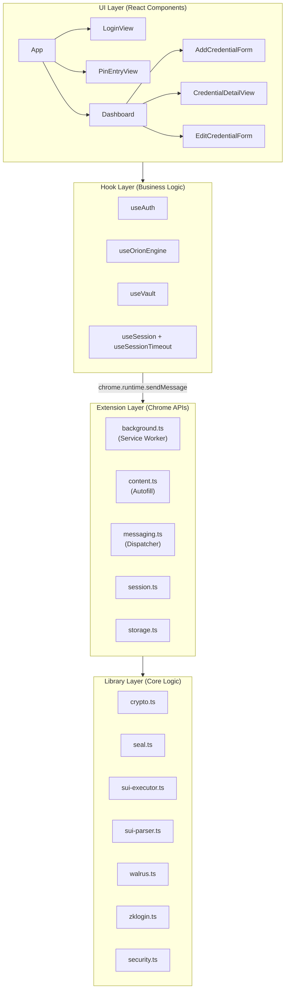
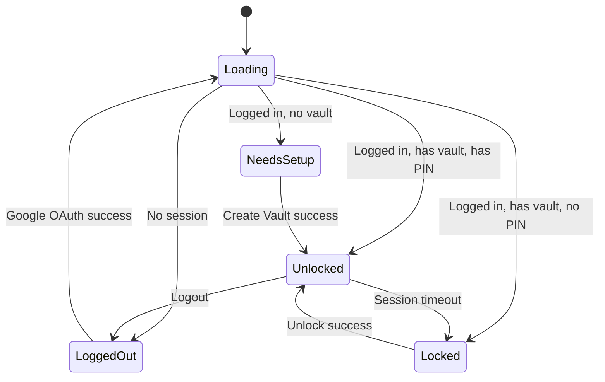
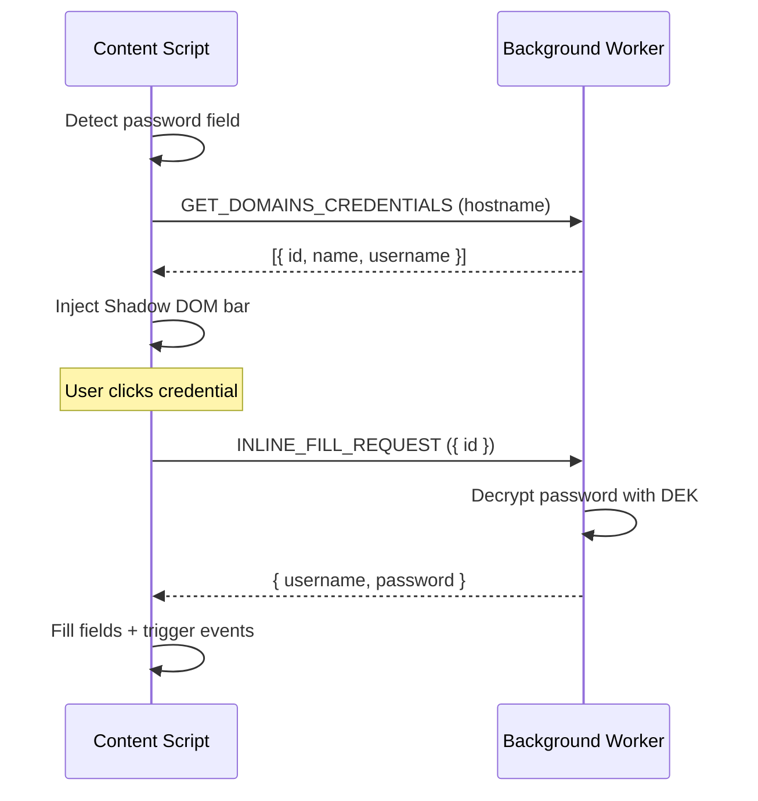

# Extension Overview

The Orion Extension is a **Chrome Manifest V3** browser extension built with React, TypeScript, and Vite. It is the primary user interface for managing the encrypted vault.

## Project Structure

```
orion-extension/
├── src/
│   ├── main.tsx                    # Entry point
│   ├── App.tsx                     # Root component + state machine
│   ├── config.ts                   # Centralized configuration
│   ├── components/
│   │   ├── LoginView.tsx           # Google OAuth login screen
│   │   ├── PinEntryView.tsx        # Create / Unlock / Recover vault
│   │   ├── Dashboard.tsx           # Credential list + search
│   │   ├── Header.tsx              # Sync status, settings, logout
│   │   ├── AddCredentialForm.tsx   # New credential form
│   │   ├── EditCredentialForm.tsx  # Edit credential form
│   │   ├── CredentialDetailView.tsx# Password reveal + autofill
│   │   └── ChangePasswordModal.tsx # Master PIN change flow
│   ├── extension/
│   │   ├── background.ts          # Service worker (Secrets Engine)
│   │   ├── content.ts             # Autofill injection (Shadow DOM)
│   │   ├── messaging.ts           # Type-safe message dispatch
│   │   ├── session.ts             # Session lifecycle manager
│   │   ├── storage.ts             # Local storage abstraction
│   │   └── constants.ts           # Centralized storage key enums
│   ├── hooks/
│   │   ├── useOrionEngine.ts      # Initialize / Unlock / Recover
│   │   ├── useVault.ts            # CRUD + sync orchestration
│   │   ├── useAuth.ts             # Google login state
│   │   ├── useSession.ts          # Session polling
│   │   └── useSessionTimeout.ts   # Auto-lock timer
│   └── lib/
│       ├── crypto.ts              # AES-256-GCM + Argon2id engine
│       ├── seal.ts                # SuiSealClient orchestrator
│       ├── sui-executor.ts        # zkLogin TX signing + execution
│       ├── sui-parser.ts          # On-chain object discovery
│       ├── walrus.ts              # Walrus blob read/write
│       ├── walrus-adapter.ts      # High-level Walrus operations
│       ├── zklogin.ts             # OAuth + Enoki integration
│       ├── security.ts            # Credential encryption manager
│       ├── vault.ts               # Vault type definitions
│       └── utils.ts               # Polling utility
```

## Architecture Layers



## Messaging System

All communication between the popup UI and the background service worker uses a **typed message dispatch system**:

```typescript
// Type-safe message types
const MessageType = {
  SET_SESSION: 'SET_SESSION',
  GET_SESSION: 'GET_SESSION',
  EXTEND_SESSION: 'EXTEND_SESSION',
  CLEAR_SESSION: 'CLEAR_SESSION',
  GET_VAULT: 'GET_VAULT',
  SAVE_SECRET: 'SAVE_SECRET',
  DELETE_SECRET: 'DELETE_SECRET',
  UPDATE_SECRET: 'UPDATE_SECRET',
  SYNC_VAULT: 'SYNC_VAULT',
  AUTOFILL_REQUEST: 'AUTOFILL_REQUEST',
  FILL_FIELDS: 'FILL_FIELDS',
  GET_DECRYPTED: 'GET_DECRYPTED',
  GET_DOMAINS_CREDENTIALS: 'GET_DOMAINS_CREDENTIALS',
  INLINE_FILL_REQUEST: 'INLINE_FILL_REQUEST',
  START_LOGIN: 'START_LOGIN',
  CHANGE_MASTER_PASSWORD: 'CHANGE_MASTER_PASSWORD',
  RECOVER_MASTER_PASSWORD: 'RECOVER_MASTER_PASSWORD',
} as const;
```

The `MessageDispatcher` class in the background worker provides a **chainable registration API**:

```typescript
const dispatcher = new MessageDispatcher();

dispatcher
  .register(MessageType.SET_SESSION, (payload) => ...)
  .register(MessageType.GET_VAULT, () => ...)
  .register(MessageType.SYNC_VAULT, executeSyncVault)
  .listen();
```

## Application State Machine

The `App.tsx` component manages the top-level application state:



## Content Script (Autofill Engine)

The `content.ts` module is injected into all web pages and provides:

1. **Field Detection:** Scans for `input[type="password"]` and adjacent username fields
2. **Domain Matching:** Queries the background for credentials matching the current hostname
3. **Shadow DOM UI:** Injects a premium autofill bar below the password field, completely isolated from the host page's CSS

The autofill bar features:
- Emerald-and-black signature glass theme
- Animated dropdown with avatar initials
- One-click fill with success animation feedback
- Multiple account support



## Configuration

All configuration is centralized in `config.ts`:

```typescript
const TESTNET_CONFIG: OrionConfig = {
  network: 'testnet',
  sui: {
    packageId: '0xfd5ea9c...292b',
    moduleName: 'sui_seal',
  },
  zkLogin: {
    googleClientId: '690944...com',
    enokiApiKey: 'enoki_public_...',
    enokiEndpoint: 'https://api.enoki.mystenlabs.com/v1',
  },
  walrus: {
    publisher: 'https://publisher.walrus-testnet.walrus.space',
    aggregator: 'https://aggregator.walrus-testnet.walrus.space',
  },
  gas: {
    sponsorUrl: 'http://localhost:3001/sponsor',
  },
  security: {
    defaultTimeoutMinutes: 15,
    timeoutOptions: [
      { label: '1 minute', value: 1, desc: 'Highest security' },
      { label: '15 minutes', value: 15, desc: 'Balanced' },
      { label: '1 hour', value: 60, desc: 'Standard' },
      { label: 'Never', value: 0, desc: 'Always unlocked' },
    ]
  },
};
```
