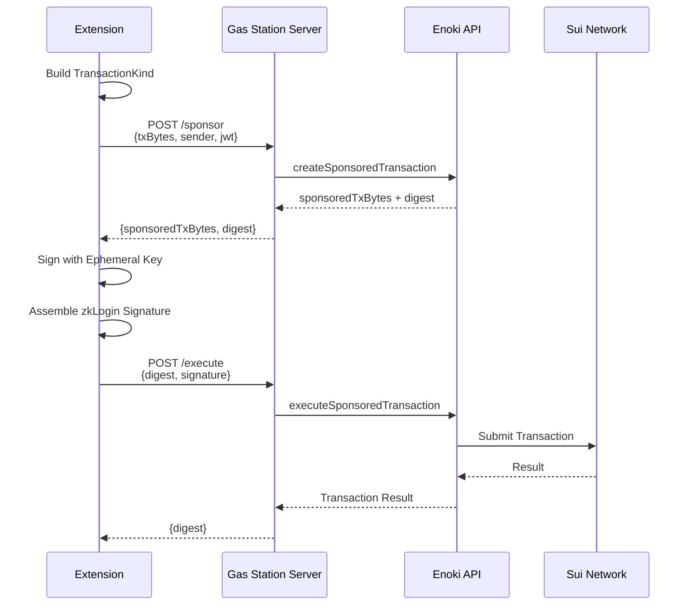

# Gas Station

The Orion Gas Station is a lightweight Node.js server that **sponsors all blockchain transactions** for Orion users. This means users never need to hold SUI tokens — the project covers all gas fees via Mysten's Enoki Sponsored Transaction API.

## Why Sponsored Transactions?

For a password manager to achieve mainstream adoption, users cannot be expected to:
- Understand gas fees
- Acquire SUI tokens from an exchange
- Manage a separate crypto wallet

Sponsored transactions eliminate this friction entirely.

## Architecture



## API Endpoints

### `POST /sponsor`

Creates a sponsored transaction.

**Request:**
```json
{
  "txBytes": "<base64-encoded TransactionKind>",
  "sender": "0x...",
  "jwt": "<google-oauth-jwt>"
}
```

**Response:**
```json
{
  "sponsoredTxBytes": "<base64>",
  "digest": "<transaction-digest>"
}
```

### `POST /execute`

Executes a previously sponsored transaction with the user's zkLogin signature.

**Request:**
```json
{
  "digest": "<transaction-digest>",
  "signature": "<zklogin-signature>"
}
```

**Response:**
```json
{
  "digest": "<final-transaction-digest>"
}
```

## Extension Integration

The `SuiExecutor` class handles the client-side assembly:

```typescript
// 1. Build TransactionKind (commands only)
const txBytes = await tx.build({
  client: this.client,
  onlyTransactionKind: true,
});

// 2. Request Sponsorship
const sponsorResponse = await fetch(sponsorUrl, {
  method: 'POST',
  headers: { 'Content-Type': 'application/json' },
  body: JSON.stringify({
    txBytes: btoa(String.fromCharCode(...txBytes)),
    sender: sender,
    jwt: jwt,
  }),
});

// 3. Sign with Ephemeral Key
const { sponsoredTxBytes } = await sponsorResponse.json();
const finalTxBytes = base64ToBytes(sponsoredTxBytes);
const { signature } = await ephemeralKeyPair.signTransaction(finalTxBytes);

// 4. Assemble zkLogin Signature
const zkLoginSignature = getZkLoginSignature({
  inputs: zkProof,
  maxEpoch: Number(maxEpoch),
  userSignature: signature,
});

// 5. Execute
const executeResponse = await fetch(executeUrl, {
  method: 'POST',
  body: JSON.stringify({ digest, signature: zkLoginSignature }),
});
```

<Callout type="info">
  The Gas Station server is configured to run on `http://localhost:3001`. For production deployment, it should be placed behind HTTPS with rate limiting.
</Callout>
