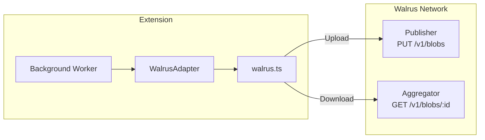

# Walrus Integration

Orion uses **Walrus Protocol** as its decentralized storage layer. All encrypted vault data is stored as content-addressed blobs on the Walrus network, ensuring data permanence and censorship resistance.

## Architecture



## Components

### walrus.ts — Low-Level Client

Handles raw HTTP interactions with Walrus endpoints:

```typescript
// Upload encrypted blob
async function storeBlob(
  data: Uint8Array | Blob,
  epochs: number = 1
): Promise<string> {
  const url = `${WALRUS_PUBLISHER}/v1/blobs?epochs=${epochs}`;
  const response = await fetch(url, {
    method: 'PUT',
    body: data,
  });
  // Handle newlyCreated, alreadyCertified, or direct blobId
  return blobId;
}

// Download encrypted blob
async function readBlob(blobId: string): Promise<Uint8Array> {
  const url = `${WALRUS_AGGREGATOR}/v1/blobs/${blobId}`;
  const response = await fetch(url);
  return new Uint8Array(await response.arrayBuffer());
}
```

### WalrusAdapter — High-Level Operations

Provides typed operations for the `WrappedVaultPayload`:

```typescript
class WalrusAdapter {
  // Serialize, encode, and upload
  async storeWrappedPayload(
    payload: WrappedVaultPayload
  ): Promise<string> {
    const bytes = new TextEncoder().encode(JSON.stringify(payload));
    return await storeBlob(bytes);
  }

  // Download, decode, and deserialize
  async readWrappedPayload(
    blobId: string
  ): Promise<WrappedVaultPayload> {
    const data = await readBlob(blobId);
    return JSON.parse(new TextDecoder().decode(data));
  }

  // Convert Sui RPC blob_id (vector<u8>) to string
  parseBlobId(rawBlobId: any): string {
    if (Array.isArray(rawBlobId)) {
      return new TextDecoder().decode(new Uint8Array(rawBlobId));
    }
    return rawBlobId;
  }
}
```

## Endpoints

| Endpoint | URL | Purpose |
|---|---|---|
| **Publisher** | `https://publisher.walrus-testnet.walrus.space` | Upload blobs |
| **Aggregator** | `https://aggregator.walrus-testnet.walrus.space` | Download blobs |

## Response Format

Walrus returns different response shapes depending on whether the blob is new or already exists:

```typescript
interface WalrusUploadResponse {
  newlyCreated?: {
    blobObject: {
      id: string;
      blobId: string;
      storage: { startEpoch: number; endEpoch: number };
    };
  };
  alreadyCertified?: {
    blobId: string;
    event: { txDigest: string; eventSeq: string };
  };
}
```

The `storeBlob` function handles both cases transparently, always returning a `blobId` string.

## Data Flow

<Steps>

### Upload (Sync)
1. Vault data is encrypted with DEK → `vaultPackage`
2. DEK is wrapped with KEK → `encryptedDEK`
3. Recovery DEK is preserved → `recoveryDEK`
4. All three are bundled into `WrappedVaultPayload`
5. JSON-serialized and uploaded as a binary blob
6. Walrus returns a content-addressed `blobId`
7. `blobId` is stored on-chain via `update_key`

### Download (Unlock/Recovery)
1. `EncryptedVaultKey.walrus_blob_id` is read from Sui
2. The blob is fetched from the Walrus Aggregator
3. Parsed into `WrappedVaultPayload`
4. `encryptedDEK` is decrypted with KEK → DEK
5. `vaultPackage` is decrypted with DEK → vault data

</Steps>

<Callout type="info">
  Walrus storage is **content-addressed** — the same encrypted payload always produces the same `blobId`. If nothing changed, the upload is a no-op (`alreadyCertified` response).
</Callout>
